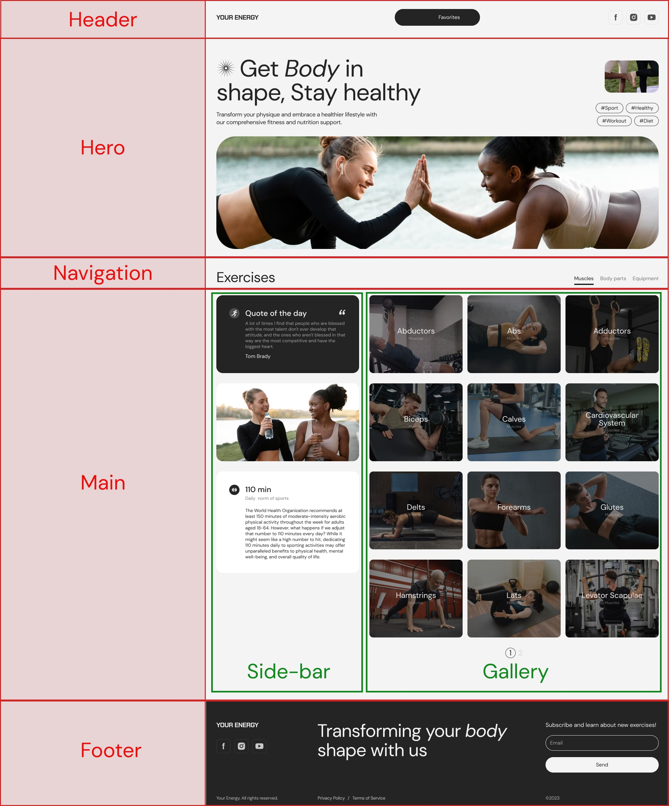

# Команда Розробки

<table>
<tr>
<th align="center" width="440px">

 
<small>
  <ul>
      <li>
        
Олексій Мироненко

        
      </li>
      <li>
        
Наталія Ходорова

        
      </li>
      <li>
        
Максим Зиза

        
      </li>
      <li>
        
Максим Лесковець

        
      </li>
      <li>
        
Максим Норіцин

        
      </li>
    </ul>
</small>

</th>
<th align="center" width="440px">

 
<small>
  <ul>
      <li>
        
Дмитро Яговкін

        
      </li>
      <li>
        
Дмитро Жук

        
      </li>
      <li>
        
Олена Горобець

        
      </li>
      <li>
        
Денис Лєнський

        
      </li>
    </ul>
</small>

</th>
</tr>
</table>

# Template

# Vanilla App Template

Этот проект был создан при помощи Vite. Для знакомства и настройки
дополнительных возможностей [обратись к документации](https://vitejs.dev/).
